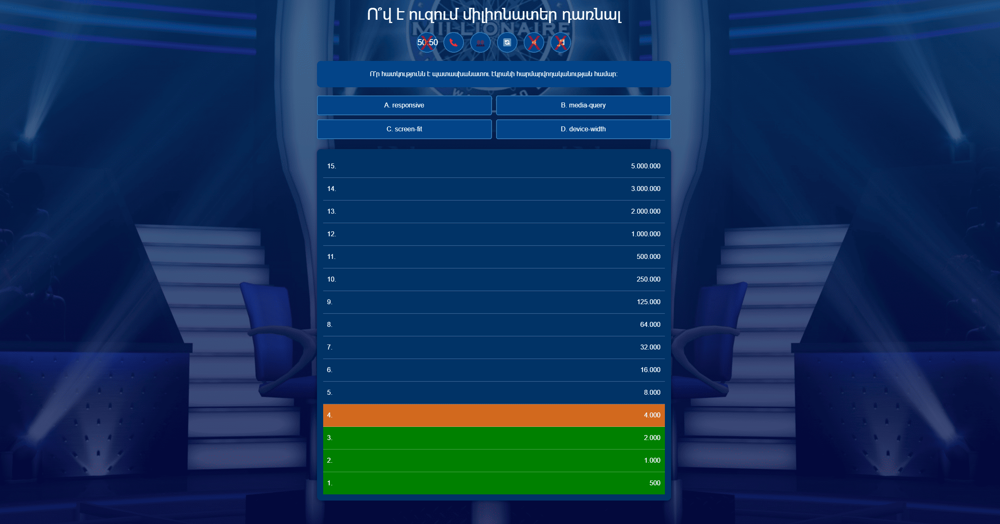

# 💎 Millionaire Game

Welcome to the **Millionaire Game**, an interactive and exciting trivia game that tests your knowledge and intuition. Climb your way to the top, answer all the questions correctly, and win your **million**!

<div align="center">
  <h2 align="center">Millionaire Game</h2>
  <a href="#"><strong>➥ Live Demo</strong></a>
</div>

<br />

---

## 🌟 Features

- ❓ **Dynamic Question System**: Questions are randomly selected, making every game unique.
- 🖱️ **User-Friendly Interface**: Designed with a simple and accessible interface for all users.
- 🔊 **Sound Effects**: Enjoy sound effects for correct and incorrect answers.
- 🎮 **Special Features**:
  - **50/50**: Removes two incorrect answers, leaving only two options.
  - **Call a Friend**: Simulates asking a friend for advice.
  - **Ask the Audience**: Get "audience" feedback on the best option.
  - **Change the Question**: Skip to the next question.

---

## 📸 Project Demo



---

## 🛠️ Requirements

To run the game, ensure you have the following:

- [Git](https://git-scm.com/downloads "Download Git") to clone the project.
- Any modern browser to open and play the game.

---

## 🚀 Run Locally

### Linux and macOS:
```bash
sudo git clone https://github.com/Danyos/Millionaire-Game
cd millionaire-game
open index.html
```

### Windows:
```bash
git clone https://github.com/Danyos/Millionaire-Game
cd millionaire-game
start index.html
```

---

## 🤝 Contributing

Contributions, issues, and feature requests are welcome! If you have ideas, feel free to open an [issue](#) or submit a pull request.

---

## 📄 License

This project is **free to use** and does not include any licensing restrictions.

---

### 💡 Suggestions

Have ideas to improve the game? Open an issue or reach out with your feedback. Let’s make this game even better together! 😊
